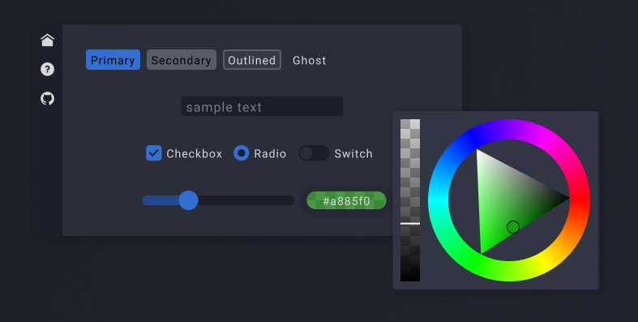

# Onyx
Beautiful immediate-mode gui that runs as fast as your monitor.



## What?
This library is designed by me, for me, based on what I like, but I expect that it will end up being very customizable visually.

## How?
Windowing is handled by GLFW, the code for this is very minimal and is subject to change as I develop on different platforms in the future.

Rendering is and will always be done with WGPU; because of this, all WGPU resources are exposed and allowed to be used by the rest of the app.

A somewhat complex SDF shader is used for drawing shapes with limited support for custom scissors and paints.  This results in really pretty graphics while taking a massive load off of the CPU.  So far, I've seen framerates as high as 2000+ on integrated Intel UHD 630 graphics running the demo.

Objects are immediate, but their functionality can be split apart to allow for advanced layouts.

**Example**:
```odin
// You can just call
button(&{text = "do segfault"})

// Or you can do it like this
btn := Button_Info{text = "clickest thou me?"}
init_button(&btn)
// Not you have the button's desired size based on it's text
fmt.println(btn.desired_size)
// And when you want to display the button just call
add_button(&btn)
```

In this example, the `btn` value is obviously **transient** and should not be used outside of it's GUI scope.  The same goes for any object info value

Layouts use the dead simple rect-cut method, give it a side to cut from and just add objects.  You optionally specify object size or margin.

## Can I use it?
It's not nearly production ready yet, has no docs and calling it stable is still a stretch, but do as you will, I can't stop you.

**Note**: you must also have the [vgo](https://github.com/isaiah-parton/vgo) package in the same folder as onyx

## Ok, and?

Stuff i'm working on:
- Popups
- Helpers for retaining container scroll/zoom and other things
- Forms for tab focusing
- Better control over layer sorting
